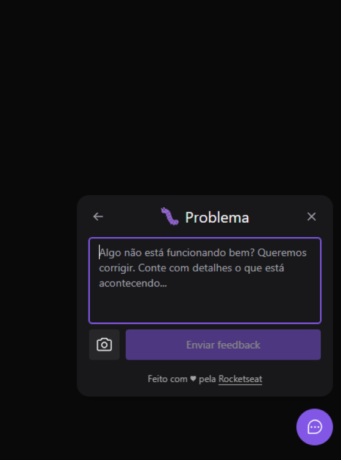

# FeedBack Widget (Feedget)

Widget de feedback desenvolvido durante a semana do NLW Return, 8º edição deste evento da @rocketseat 💜 :rocket:.

## Sobre a aplicação

A aplicação consiste num widget que possibilita o envio de feedbacks além de tirar um screenshot da tela para envio.

## Screenshots

### Desktop App:

  
  
  
  

### Mobile App:

  
  
  
  

## Como rodar a aplicação?

**1.** Clone este repositório com o seguinte comando:

`git clone git@github.com:Kamila-Vieira/FeedBack-widget.git`

**2.** Você vai precisar ter o **Node.js** e o **Expo** instalados na sua máquina.

> [Como instalar o Node.js](https://nodejs.org/en/). 
> [Como instalar o Expo](https://docs.expo.dev/get-started/installation/).

**3.** Entre nas três pastas (web, server e mobile) e instale as dependências do projeto de cada uma delas com o comando:

`npm install`

**4.** Crie o arquivo `.env` na raíz do projeto backend na pasta server e adicione a variável de ambiente "DATABASE_URL" com a sua string de conexão do banco de dados PostgreSQL como valor desta variável, em seguida inicie a aplicação com o comando:

`npm run dev`

**5.** Crie o arquivo `.env.local` na raíz do projeto web desktop na pasta web e adicione a variável de ambiente "VITE_API_URL" com a sua url local do backend como valor desta variável (se a porta não tiver sido alterada, o valor inicial será o http://localhost:3333), em seguida inicie a aplicação com o comando:

`npm run dev`

**6.** Finalmente, para visualizar a aplicação mobile, entre na pasta mobile e rode o seguinte comando:

`npm start`

**7.** Para ver este aplicativo em seu dispositivo (iOS ou Android), você precisa instalar o aplicativo Expo na loja de aplicativos:

> [Expo Client](https://apps.apple.com/br/app/expo-client/id982107779) para iOS. 
> [Expo](https://play.google.com/store/apps/details?id=host.exp.exponent&hl=pt_BR) para Andoid.

Em seguida, digitalize o código QR com o aplicativo Expo (Android) ou o aplicativo Câmera (iOS).

**Isto é tudo! :heart: 
Se você tiver dúvidas sobre o Feedget, você pode perguntar no [GitHub Issues](https://github.com/Kamila-Vieira/FeedBack-widget/issues).**

## Atualização V2 (em breve):

